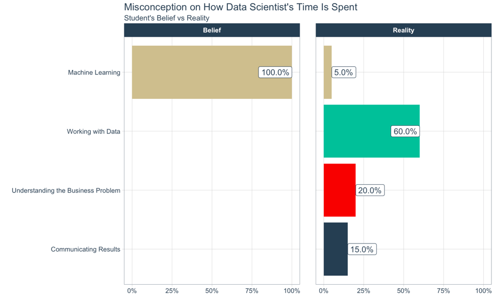
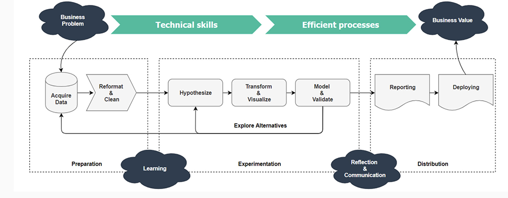

```{r setup, include=FALSE}
knitr::opts_chunk$set(echo = TRUE)
library(knitr)
library(tidyverse)
library(plotly)
library(DBI)
```


# Which companies use R
<br/>
  **For behavior analysis related to status updates and profile pictures**
<br>
  **For advertising effectiveness and economic forecasting.**
<br>
  **Acquired Revolution R company and use it for a variety of purposes.**
<br>
  **For data visualization and semantic clustering.**
<br>
  **For statistical analysis**
<br>
  **Scale data science.**
<br>
  ****
<br>
And many more...

# Why use R, Even python can do all this stuff

Think of R like a cat!
<br>
And  Python like dog!
<br>
Both are great pets to have, Some people like one over the other. But at the end of the day both are amazing
<br>
The problem starts when someone looks at R and expects it to be a dog
<br>
**"You're dog is broken!"**
<br>
R has some strange parts, but it compenstates with some great parts. They are not just good, but great
<br>
Some parts of R are better than python and some parts of python are better than R.
<br>





# Acquiring the data

Data can be acquired from many sources into R.
R supports data formats like csv, xlsx, spss, sas or any remote database like MySQL, SQLite, PostgreSQL, MonetDB, etc

The most used methods are to read data from a csv, xlxs or txt file or connecting to MySQL or SQLite data base
<br>
  **Used for obtaining rectangular data into R like "csv", "tsv", and "fwf"**
<br>
  **Used to import excel files into R**
<br>
  **R interface to Apache Spark to work with big data**
<br>
  **Manage Google Drive files from R.**
<br>
  **Interact with Google Sheets from R.**
<br>
  **Used for web scraping. This package is wrapped around the 'xml2' and 'httr' packages to make it easy to download, then manipulate, HTML and XML**
<br>

### Reading local data

We can read a .csv data using the base **read.csv()** function or using **read_csv()** function from the **readr** package


```{r}
data <- read.csv("datasets/adult_data.csv")
names(data) <- c("age", "workclass", "fnlwgt", "education", "education_num", "marital_status", "occupation", "relationship", "race", "gender", "capital_gain", "capital_loss", "hours_per_week", "native_country", "predictive_variable")
head(data)
```

In order to obtain data from remote database like **SQLLite**
First we need to establish a connection to the database
```{r}
con <- dbConnect(RSQLite::SQLite(), dbname = ":memory:")
```
```{r echo = FALSE}
dbWriteTable(con, "mtcars", mtcars, overwrite = TRUE)
dbWriteTable(con, "iris", iris, overwrite = TRUE)
```
Then we can use this connection object to access and edit the database
```{r}
dbListTables(con)
mtcarsData <- dbReadTable(con, "mtcars")
str(mtcarsData)
dbDisconnect(con)
```

# Cleaning the data

In the real world the data is not always "clean".
There are many ways to define clean.
Common things to look out for:

* Look out for **NULL** or **NA** values
* Check if there are **duplicates**
* Verify the **data type** for every column/feature

<br>
  **dplyr is one of the most used package for data wrangling in R**
<br>
  **Also a very popular package for data wrangling**
<br>
  **Used for string manupulation**
<br>
  **Used to work with dates data**
<br>
  **Used to work with time data**
<br>


# Understanding the data

### **Understand every column of the data first**

#### Numerical data fields
**Age**
```{r}
ggplot(data, aes(x = data$age)) + geom_bar()
```

**Hours worked per week**
```{r}
ggplot(data, aes(x = data$hours_per_week)) + geom_histogram(binwidth=10)
```

### Categorical data fields

**Marital Status**
```{r}
data_marital_status <- data %>% group_by(marital_status) %>% summarise(count = n())
ggplotly(ggplot(data_marital_status, aes(x = reorder(marital_status, count), y = count)) + geom_col() + coord_flip())
ggplot(data_marital_status, aes(x = "", y = count, fill = reorder(marital_status, - count)))+
    geom_bar(width = 1, stat = "identity") +
    coord_polar("y", start=0)
```

**Education**
```{r}
ggplotly(ggplot(data %>% group_by(education) %>% summarise(count = n()), aes(x = reorder(education, count), y = count)) + geom_col() + coord_flip())
```
**Occupation**
```{r}
ggplotly(ggplot(data %>% group_by(occupation) %>% summarise(count = n()), aes(x = reorder(occupation, count), y = count)) + geom_col() + coord_flip())
```
**Relationship**
```{r}
ggplotly(ggplot(data %>% group_by(relationship) %>% summarise(count = n()), aes(x = reorder(relationship, count), y = count)) + geom_col() + coord_flip())
```
**Race**
```{r}
ggplotly(ggplot(data %>% group_by(race) %>% summarise(count = n()), aes(x = reorder(race, count), y = count)) + geom_col() + coord_flip())
```
**Gender**
```{r}
ggplotly(ggplot(data %>% group_by(gender) %>% summarise(count = n()), aes(x = reorder(gender, count), y = count)) + geom_col() + coord_flip())
```
**Native Country**
```{r}
ggplotly(ggplot(data %>% group_by(native_country) %>% summarise(count = n()), aes(x = reorder(native_country, count), y = count)) + geom_col() + coord_flip())
```

### **Now try to make hypothesis and test them**

## Hypothesis 1

People who study more make more money

```{r}
data$is_rich <- if_else(data$predictive_variable == "<=50K", 0, 1)
education_summary <- data %>% group_by(education) %>% summarise(number_of_rich_people = sum(is_rich), number_of_poor_people = n() - number_of_rich_people, total_people = n())
education_summary
```

## Hypothesis 2

People who work under government are likely to make more money

## Hypothesis 3

People who work more make more money

## Hypothesis 4

Men make more money than Women?

## Hypothesis 5


## Hypothesis 6

### Predicting the salary

There are many ways to predict a variable, depending on the data type.
<br/>
If the variable you need to predict is a number, you need to use **regression**
<br/>
If the variable you need to predict is a categorical, you need to use **classification**
<br/>
Some famous *regression algorithms* are:

* Linear Regression
* Logistic Regression
* Polynomial Regression
* Stepwise Regression
* Ridge Regression
* Lasso Regression
* ElasticNet Regression

Some famous *classification algorithms* are:

* Naive Bayes Classifier
* Nearest Neighbor
* Support Vector Machines
* Decision Trees
* Boosted Trees
* Random Forest
* Neural Networks

All algorithms will generate a model/formula, Creating the model is often refered to as training
<br/>
You can store the models in a variable and use them later on to predict.
<br/>

#### Using Naive Bayes Classifier

```{r}
library(e1071)
naive_bayes_model <- naiveBayes(predictive_variable ~ ., data = data)
predicted_values_from_naive_bayes_model <- predict(naive_bayes_model, data)
tab <- table(predicted_values_from_naive_bayes_model,data$predictive_variable)
print(tab)
1 - sum(diag(tab)) / sum(tab)
```


#### Using Decision Tree

```{r}
library(party)
decision_tree_model <- ctree(predictive_variable ~ ., data = data)
predicted_values_from_decision_tree_model <- predict(decision_tree_model, data)
tab <- table(predicted_values_from_decision_tree_model,data$predictive_variable)
print(tab)
1 - sum(diag(tab)) / sum(tab)
```

#### Using Random Forest

```{r}
library(randomForest)
random_forest_model <- randomForest(predictive_variable ~ ., data = data)
plot(random_forest_model)
predicted_values_from_random_forest_model <- predict(random_forest_model, data)
tab <- table(predicted_values_from_random_forest_model,data$predictive_variable)
print(tab)
1 - sum(diag(tab)) / sum(tab)
```

# Publishing the insights
<br>
  **Rmarkdown allows you to create reproducible results that can be shared as a HTML, PDF, PPT or Word format.**
<br>
  **Shiny allows you to create interactive web applications.**
<br>


# Exercise problem
<br/>

### Analyze iris dataset and  come up with interesting insights about the data. Also predict the Species of these data points

```{r}
newData <- data.frame(
    Sepal.Length = c(5.7, 6.3, 7.2),
    Sepal.Width = c(4.4, 2.9, 3.1),
    Petal.Length = c(1.4, 4.0, 5.1),
    Petal.Width = c(0.2, 1.0, 2.3),
    Species = ""
)
newData
```


#### Numeric Data

##### Sepal.Length

```{r}
ggplot(iris, aes(x = Sepal.Length)) + geom_histogram()
```

##### Sepal.Length

```{r}
ggplot(iris, aes(x = Sepal.Length)) + geom_histogram()
```

##### Sepal.Length

```{r}
ggplot(iris, aes(x = Sepal.Length)) + geom_histogram()
```

##### Sepal.Length

```{r}
ggplot(iris, aes(x = Sepal.Length)) + geom_histogram()
```


#### Categorical Data

##### Species

```{r}
ggplotly(ggplot(iris %>% group_by(Species) %>% summarise(count = n()), aes(x = reorder(Species, count), y = count)) + geom_col() + coord_flip())
```

#### Using only one variable to determine the type of species 

#### Trying to understand the relationships between two variables

##### Sepal length and Sepal width

```{r}
ggplot(iris, aes(x = Sepal.Length, y = Sepal.Width)) + geom_point()
ggplot(iris, aes(x = Sepal.Length, y = Sepal.Width, color = Species)) + geom_point()
```


##### Sepal length and Petal length

```{r}
ggplot(iris, aes(x = Sepal.Length, y = Petal.Length, color = Species)) + geom_point()
```

##### Sepal length and Petal width

```{r}
ggplot(iris, aes(x = Sepal.Length, y = Petal.Width, color = Species)) + geom_point()
```


##### Sepal width and Petal length

```{r}
ggplot(iris, aes(x = Sepal.Width, y = Petal.Length, color = Species)) + geom_point()
```


##### Sepal width and Petal width

```{r}
ggplot(iris, aes(x = Sepal.Width, y = Petal.Width, color = Species)) + geom_point()
```


##### Petal length and Petal width

```{r}
ggplot(iris, aes(x = Petal.Length, y = Petal.Width, color = Species)) + geom_point()
```


### Predict the Species of these corresponding data

```{r}
actual_species <- c("setosa", "versicolor", "virginica")
newData
```

#### Using Naive Bayes Classifier

```{r}
library(e1071)
naive_bayes_model <- naiveBayes(Species ~ ., data = iris)
predicted_values_from_naive_bayes_model <- predict(naive_bayes_model, iris)
tab <- table(predicted_values_from_naive_bayes_model,iris$Species)
print(tab)
1 - sum(diag(tab)) / sum(tab)
# Predicting the a newData
answer <- predict(naive_bayes_model, newData)
tab <- table(answer,actual_species)
print(tab)
1 - sum(diag(tab)) / sum(tab)
```